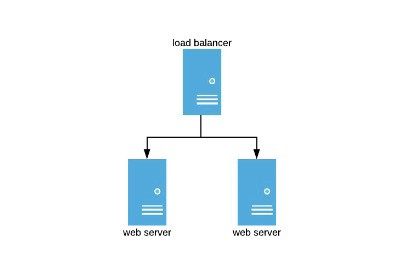

# Homework Assignment 2 (Individual)

Submission Deadline: October 25, 2022

This assignment comprises two parts. This is an individual assignment to be conducted individually by each student.

## Part 1: Load Balancing

In this part you will build and deploy an Nginx load balancing infrastructure using Ansible. 
We expect you to already have a basic familiarity with Nginx and Ansible. 

Load balancing across multiple application instances is a commonly used technique for optimizing resource utilization, maximizing throughput, reducing latency, and ensuring fault-tolerant configurations.

It is possible to use nginx as a very efficient HTTP load balancer to distribute traffic to several application servers and to improve performance, scalability and reliability of web applications with nginx.



### Software 

You will find the code for this assignment in the directory `lb`. 
The playbook `nginx-lb.yml` sets up multiple web servers and a single load balancer in front of these web servers. 
The playbook configures each web server using the configuration template `static_site.cfg.j2` and 
the load balancer using the configuration template `load-balancer.cfg.j2`.

### Load balancing static web site

Create a small cluster on CloudLab using the `multi-node-cluster` profile in the `UCY-CS499-DC` project, configured with six (6) physical machine nodes.

Deploy the load balancer and web servers serving the static site using the provided playbook `nginx-lb.yml`. 
You should deploy the load balancer on one machine (e.g., `node1`) and the web servers on other machines (e.g.,`node2`, `node3`, ...) to avoid performance interference.

Evaluate how throughput (requests/sec) and tail latency changes with increasing number of web servers (1 to 4).
You may use the HTTP benchmarking tool `wrk` to generate workload.
You should run `wrk` on different machines than the ones running the load balancer and the web servers to avoid performance interference.

### Load balancing HotelMap web service

Repeat the previous exercise for HotelMap.

## Part 2: Web Search Characterization

In this part, you will conduct a characterization and analysis of the web search benchmark. This includes, query and latency analysis, benchmark throughput and response time characterization.

### Single- vs Multi-threaded Client

For this question, you should configure the web search benchmark to run a single frontend server and a single index server, following the instructions from the Web Search Lab. You should configure the index server to run with as many threads as available cores on a single socket (as reported via `lscpu`).

You should begin with one client thread sending requests. We do this to isolate the response times from the effects of queuing, contentions on shared resources etc. This way the analysis is focused only on the time actually needed to process the query.

```
./client node1 8080 /local/websearch/ISPASS_PAPER_QUERIES_100K 1000 1 onlyHits.jsp 1 1 /tmp/out 1
```

You should then perform an investigation into how the number of client threads affects the system performance. We recommend to run the client with up to 128 threads. For example, the following runs 8 client threads on an eight-core machine:

```
./client node1 8080 /local/websearch/ISPASS_PAPER_QUERIES_100K 1000 8 onlyHits.jsp 1 1 /tmp/out 1
```

Report and comment how the performance (throughput and response latency) scales with the number of client threads. Measure the index server CPU utilization and report how the CPU utilization is correlated with performance.

### Index Partitioning

You should compare the response times of a setup using partitioning with two index servers working on different index parts and a configuration without partitioning. The queries are executed sequentially one at a time.

For this part, you should configure the web search benchmark to run a single frontend server and a two index servers using the configuration file `hosts-2-index`, and four index servers using a new configuration file `host-4-index` that you need to write.

Report and comment how partitioning affects performance (throughput and response latency).

## Point Distribution

| Problem    | Points |
|------------|--------|
| Q1.1       | 25     |
| Q1.2       | 25     |
| Q2.1       | 25     |
| Q2.2       | 25     |

### Submission

Now you need to submit your assignment. Commit your change and push it to the remote repository by doing the following:

```
$ git commit -am "[you fill me in]"
$ git push -u origin main
```

You may push you code as many times you like, grading and submission time will be based on your last push.
